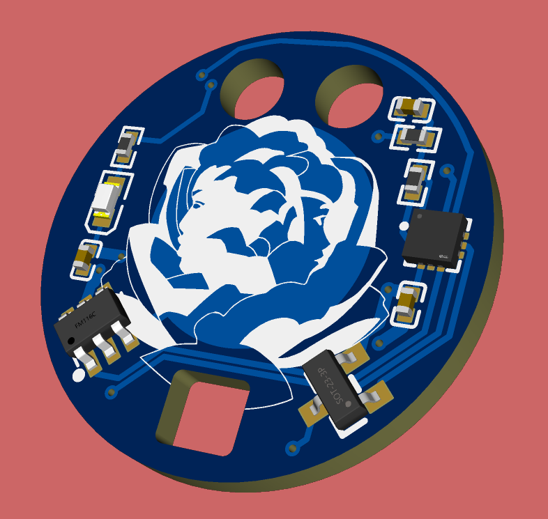
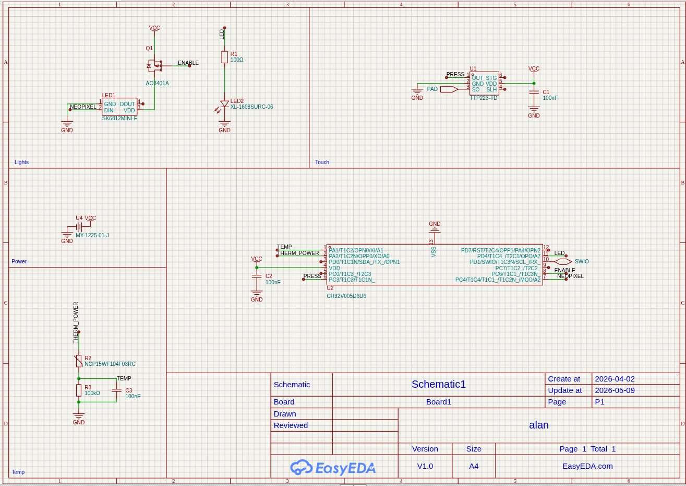
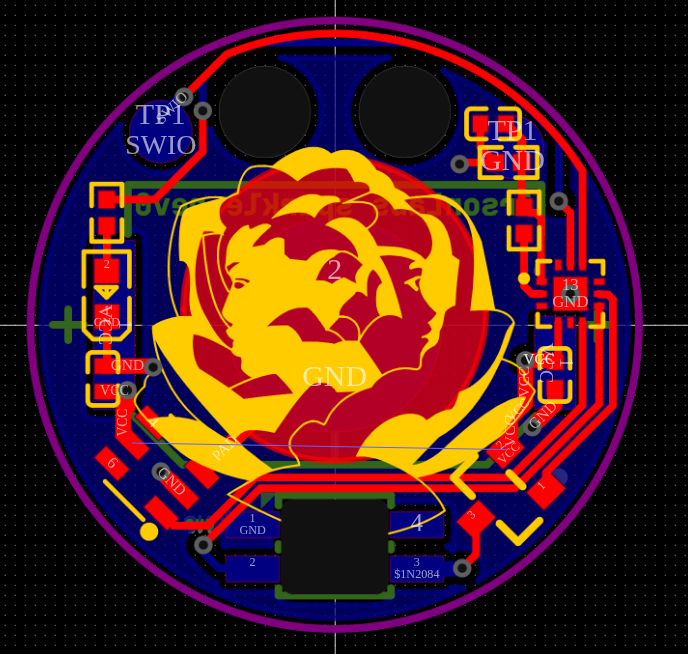

# Sparkle necklace

Small, touch-activated necklace with onboard RISC-V MCU, neopixels and temperature sensing

I made it because I wanted a cool unique gift to give :)
### Features
- **Microcontroller**: CH32V005D6U6 (WCH 32-bit RISC-V)
- **Lighting**:
  - 1× SK6812MINI-E Neopixel LED
  - 1× Red 0603 LED
- **Input**: Capacitive touch sensor (TTP223-TD)
- **Sensors**: NTC thermistor (NCP15WF104F03RC)
- **Power**:
  - 1225 coin cell battery
- **Programming**: SWIO

## Schematic

## Pcb

## Files
- [schematic.pdf](schematic.pdf)
- [pcb.pdf](pcb.pdf)
- [bom.csv](bom.csv)
- [gerbers.zip](gerbers.zip)
- [pic.png](pic.png)
- [easyeda project](alan.eprj)

## Bill of Materials (BOM) and Costs
- **PCB**: $3.10 (OSH Park)
- **SMT components**: €14.78 (LCSC)
- **WCH programmer**: €5.00 (AliExpress)
- **Lace**: €2.00 (AliExpress)
